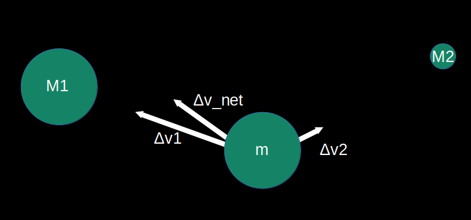
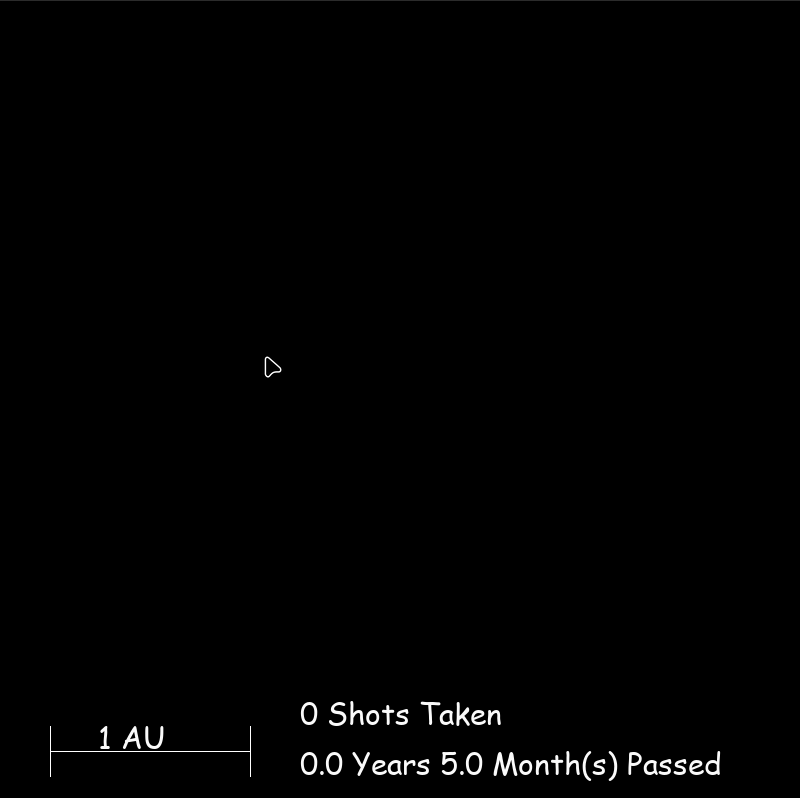
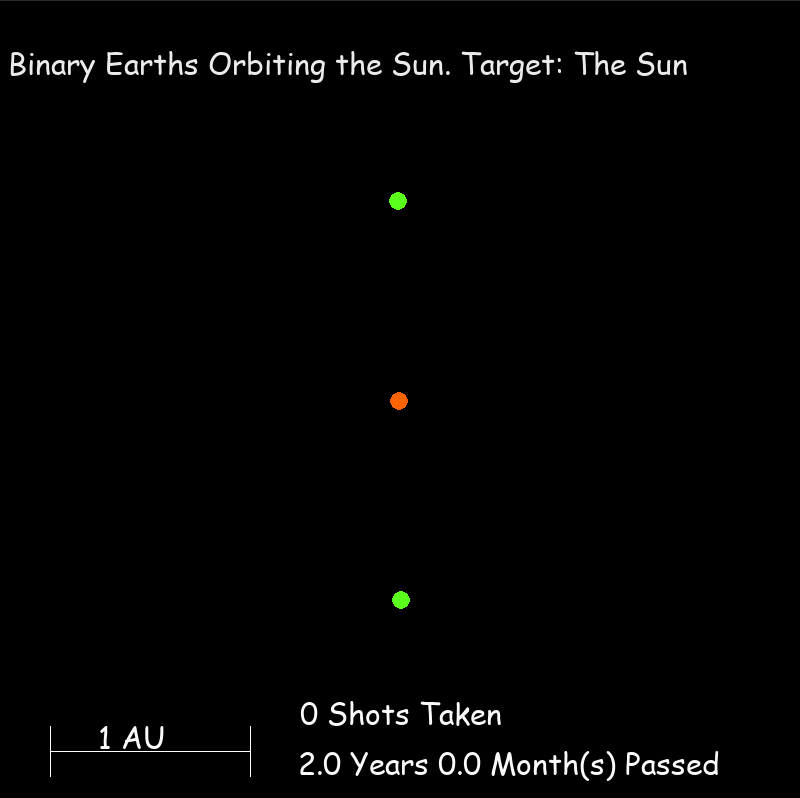
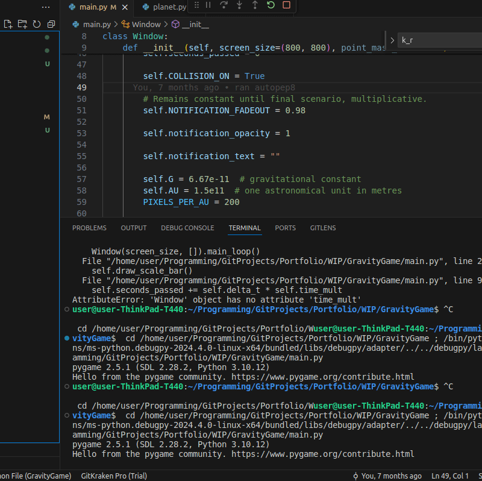

# GravityGame: GIF DEMOS AT THE BOTTOM
A WIP pygame-based gravity-simulation golf game.

The end goal of this project is to create a mostly realistic gravity-golf game. Utilising gravity slingshotting and clever uses of orbital mechanics to hit a target with your launched planet.
At the current moment of writing this, the simulation is mostly accurate, and most of the framework is in place to start making gameplay scenarios.

You can select multiple planets with the numeric keys (0-9) which correspond to the planets (and the Sun) in the solar system, with accurate masses, and their velocity can be set by clicking and dragging in a slingshot motion. For context, the Earth's current speed is ~30Km/s, and orbits can be accurately created with player placed planets (Note: shots can be cancelled with the esc key).

# Requirements

Python 3.10.12<= 

Pygame 2.5.1<=

Numpy 1.21.3<=

# Background

The simulation running is based on Newton's gravitation equation. It is an approximation that works fine for masses separated by sufficient diameter, and does not take into account relativistic effects.
These limitations are not very important for a toy simulation, but the important thing to bear in mind is that it will not take into account surface-to-surface separation of point masses.

Nonetheless, the radii of the planets in the program are greatly exaggerated, otherwise they would not show up on the screen even as a single pixel. 

First we start out by setting Newton's law of gravitation to Newton's second law, and substituting in $a=\frac{{\Delta}v}{t}$

$F = \frac{GMm}{r^2} = ma = m\frac{{\Delta}v}{t}$

Where $F$ is gravitational force, $G=6{\cdot}10^{-11}$ is the gravitational constant, $M$ and $m$ are the masses of the two interacting objects, $r$ is the CENTER TO CENTER separation and $a$ is the acceleration due to gravity. 

This can be rearranged as:

${\Delta}v = \frac{GMt}{r^2}$

${\Delta}v$ is the change in velocity of a $m$ due to an external mass $M$

By summing all of the ${\Delta}v$ terms for each mass $M$, we can get the net velocity (this is equivalent to calculating the net force). From which, we can get the distance travelled by the pointmass $m$ in a timestep $t$:

$d=v{\cdot}t$

The smaller the time-step, the more accurate the simulations. However, a default time multiplication factor of 3e6x speed was used as a real-time gravity simulation is not very entertaining. This produces acceptable accuracy while making the program feel somewhat responsive.

# Gif Demos

Note: The gifs are recorded at a very low framerate. The program maintains a steady 60fps at these object numbers.

This demo is of the "Sandbox mode" - placing the planets manually

This next demo is of two Earths orbiting the Sun. Masses, velocities and separations are all accurate.

This next demo is of random point-masses at random locations, showing off the time-scale feature.

# Future Updates

* Adding zones to where you can fire the planets from (otherwise the game is trivial)
* Sprucing up the visuals
* Creating more scenarios
* Resizable window
* Multithreading for calculations
  
